# CS506: Data Science Tools and Applications [FINAL PROJECT]
## Presentation Link
[Youtube Video](https://youtu.be/d5nVEtlqg9s)

## Overview

Modern image classifiers are trained on datasets containing heterogeneous problematic examples: truly clean images, hard-but-correct samples, near-miss label errors, gross label errors, and out-of-distribution (OOD) images. These distinct "anomaly types" are typically treated as a homogeneous "noisy" category, despite having different signatures in model behavior. This project attempts to disentangle these anomaly types by generating a synthetic dataset with controlled proportions of each type, extracting a comprehensive set of features (geometric, uncertainty, training dynamics, image quality, and human annotation metadata), and testing hypotheses about which features distinguish which anomaly types. 

**Dataset Size**: 100,000 samples (50k CIFAR-10, 50k CIFAR-100)  
**Models**: Two ViT-B/16 models (Clean ViT, Noisy ViT)  
**Features**: 20 features across 5 families (Geometry, Image Quality, Uncertainty, Dynamics, Label Agreement)  
**Hypotheses**: 4 hypotheses about which features detect which anomaly types  
**Classifiers**: Random Forest, XGBoost, Logistic Regression, SVM, KNN (5-fold stratified CV)  
**Metrics**: Per-class F1-score, macro F1, confusion matrix, feature importance analysis


### Build and Run 
1. **Clone the repository**:
```bash
git clone https://github.com/appledora/cs506-anomaly-det.git
```
2. **Navigate to the project directory**:
```bash
cd cs506-anomaly-det
```
3. **Install dependencies**:
```bash
# Create / update conda env
conda env create -f environment.yml -n cs506-anom || \
conda env update -f environment.yml -n cs506-anom
conda activate cs506-anom

# Non-interactive run (recommended to reproduce figures/tables)
jupyter nbconvert --to notebook --execute notebooks/01_data_prep.ipynb --ExecutePreprocessor.timeout=600
jupyter nbconvert --to notebook --execute notebooks/02_feature_extraction.ipynb --ExecutePreprocessor.timeout=1800
jupyter nbconvert --to notebook --execute notebooks/03_train_eval.ipynb --ExecutePreprocessor.timeout=7200

# Or run interactively
jupyter lab
```

### **Notebooks**
- [`01_generate_synthetic_noisy_cifar_vit_clean.ipynb`](01_generate_synthetic_noisy_cifar_vit_clean.ipynb): Dataset generation and anomaly type injection
- [`02_dataset_analysis_vit.ipynb`](02_dataset_analysis_vit.ipynb): Visualize dataset composition, feature distributions, and preliminary insights on feature-anomaly relationships.
- [`03_feature_extraction_and_hypothesis_testing_v2.ipynb`](03_feature_extraction_and_hypothesis_testing_v2.ipynb): Train classifiers, evaluate performance, and analyze results against hypotheses.

---

## Dataset Generation

### Data Sources

- **CIFAR-10/100**: Original images and labels from CIFAR repository
- **CIFAR-N**: Human reannotation data (CIFAR-10-N, CIFAR-100-N) for ambiguous samples
- **MIT Indoor Scenes**: 67 indoor scene categories for OOD injection
- **Pretrained ViT-B/16**: Feature extractor for semantic similarity computations

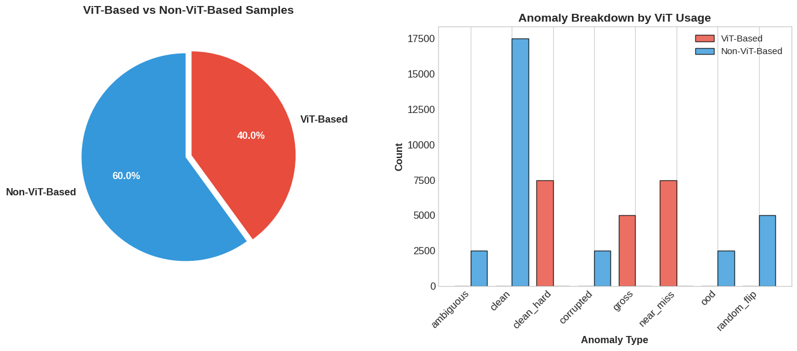
## Synthetic Dataset Composition

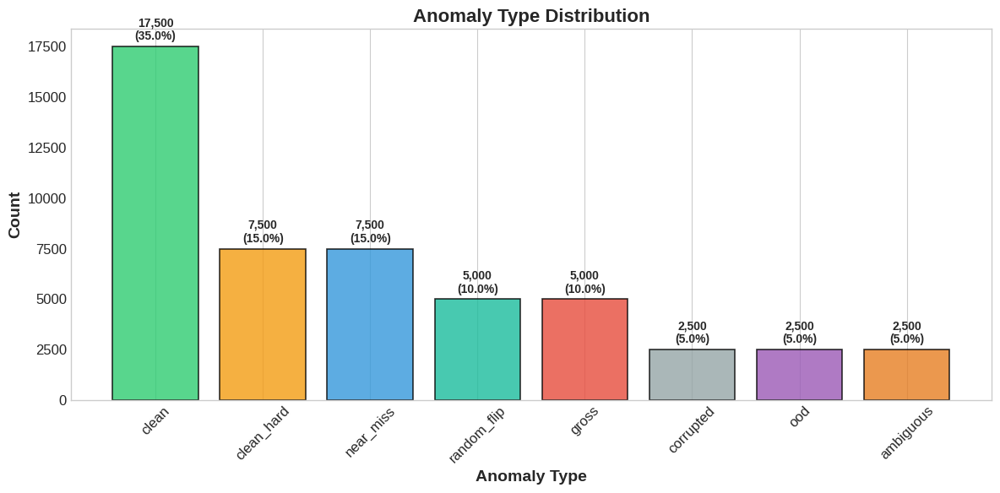
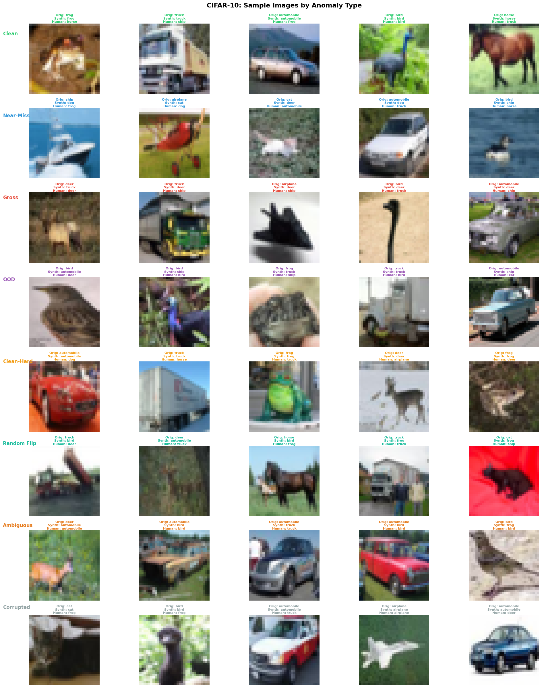
### 1. Clean (35%)
Correctly labeled samples serving as the ground truth baseline. These represent ideal training data with aligned image content and assigned label.
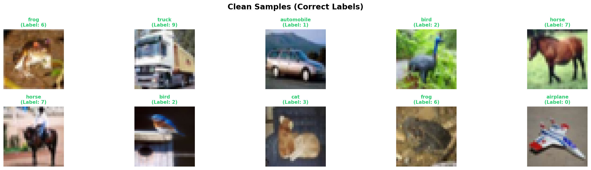
### 2. Near-Miss Label Errors (15%)
Semantically plausible but incorrect labels.
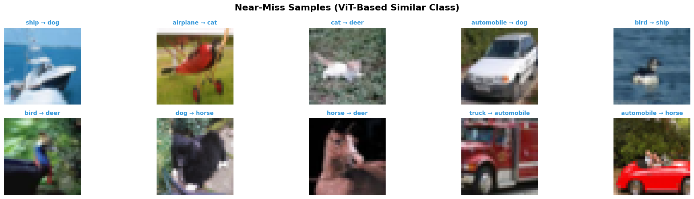
For each sample, extract ViT embedding and compute cosine similarity to all class centroids. Replace true label with one of the k=3 nearest classes (excluding true class).

**Examples**: dog → cat, truck → automobile, deer → horse

**Rationale**: Simulates annotator confusion between visually similar categories. These errors are the hardest to detect because the mislabeled class is a reasonable alternative interpretation.

### 3. Gross Label Errors (10%)
Semantically implausible label flips.
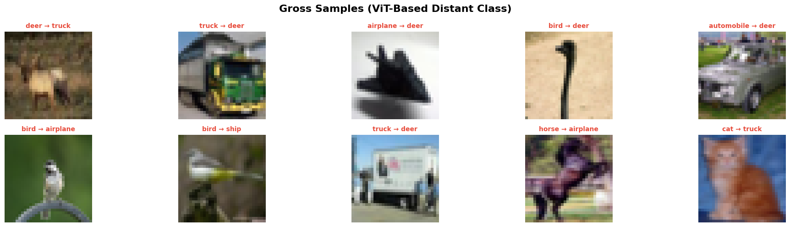
For each sample, select from the k=3 furthest classes in ViT embedding space.

**Examples**: frog → truck, bird → automobile, cat → ship

**Rationale**: Represents catastrophic annotation failures (copy-paste errors, wrong image-label pairing, database corruption). Should be easily detectable via geometric features.

### 4. Out-of-Distribution (5%)
Images that do not belong to the CIFAR domain at all.
Sample images from MIT Indoor Scenes dataset (67 categories: corridor, restaurant, bedroom, etc.) and randomly assign CIFAR labels.

**Examples**: Indoor scene labeled as "airplane", office labeled as "dog"

**Rationale**: Tests whether models can detect domain shift. These samples should have embeddings far from all CIFAR class centroids.

### 5. Clean-Hard (15%)
Correctly labeled but atypically difficult samples.
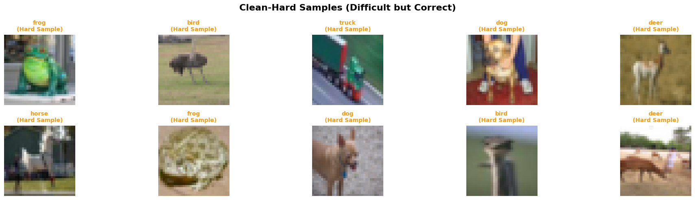
Compute cosine distance from each sample to its true class centroid in ViT space. Select the top 15% most distant samples within each class while preserving correct labels.

**Examples**: Occluded objects, unusual viewpoints, edge cases within a category

**Rationale**: Represents legitimate boundary cases. Critical for testing whether features can distinguish inherent difficulty from label errors. Clean-Hard and Near-Miss are the key challenge: both are near decision boundaries, but only one is mislabeled.

### 6. Random Flip (10%)
Uniform random label assignment, independent of image content.

Replace true label with a random class sampled uniformly from the label set.

**Examples**: Any class → any other class with equal probability

**Rationale**: Represents annotation noise with no semantic structure. Should produce high uncertainty across all samples.

### 7. Ambiguous (5%)
Samples where human annotators disagree.
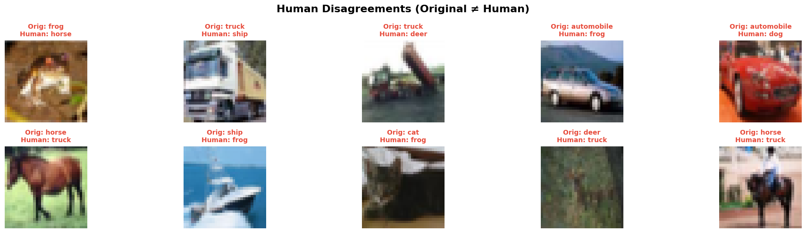
Identify samples from CIFAR-N datasets where multiple annotators provided different labels. Assign one of the human-provided labels (not necessarily the original CIFAR label).

**Examples**: Images that could reasonably be labeled as multiple classes

**Rationale**: Captures genuine label uncertainty. These samples may not be "errors" but rather reflect intrinsic ambiguity. Should have low human confidence scores and high model uncertainty.

### 8. Corrupted (5%)
Visually degraded images with correct labels.
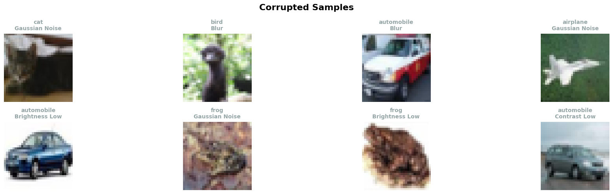
Apply one of four corruptions randomly:
- Gaussian noise: σ=25
- Gaussian blur: σ=1.5
- Contrast reduction: 0.3× original
- Brightness reduction: 0.3× original

**Examples**: Blurry cat (labeled cat), noisy airplane (labeled airplane)

**Rationale**: Tests whether models conflate low image quality with label errors. Should be distinguishable via pixel-level quality metrics independent of semantic features.
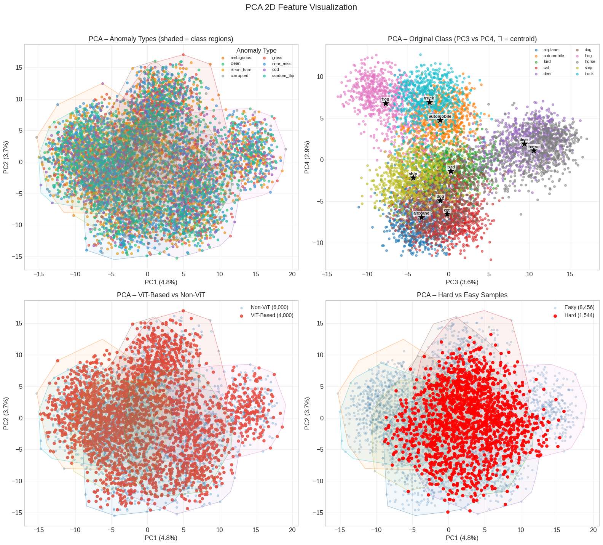

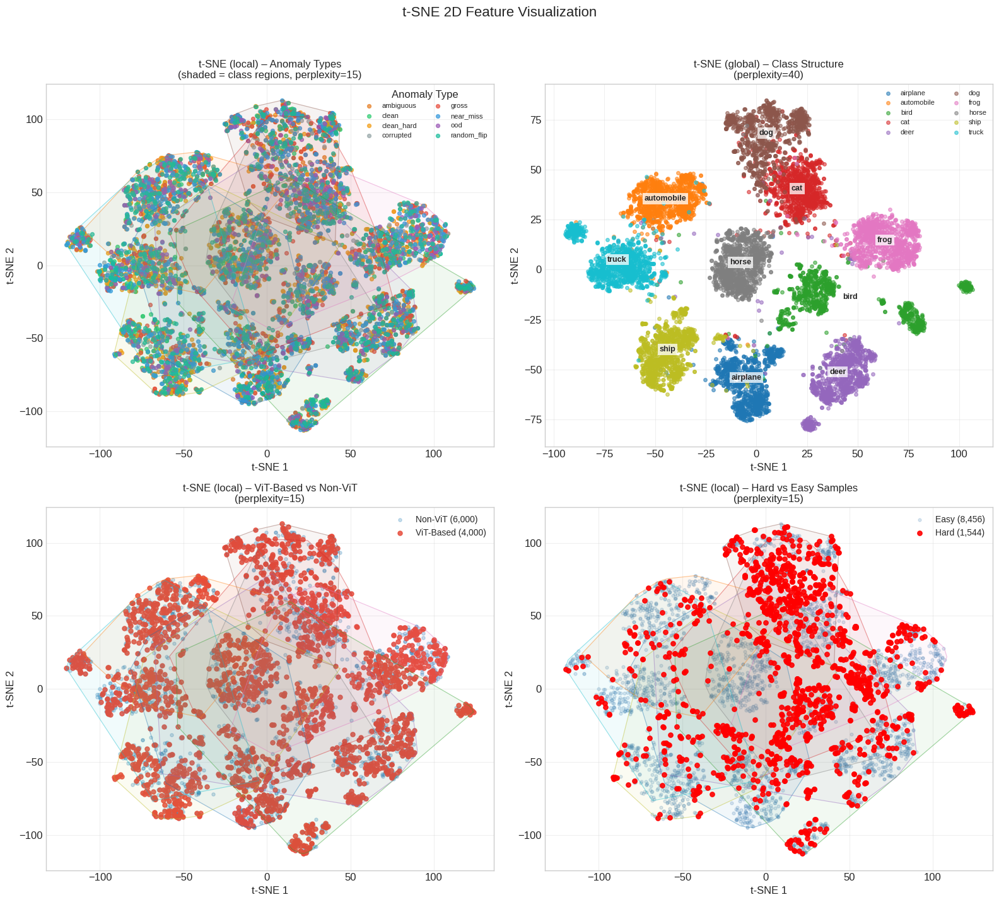

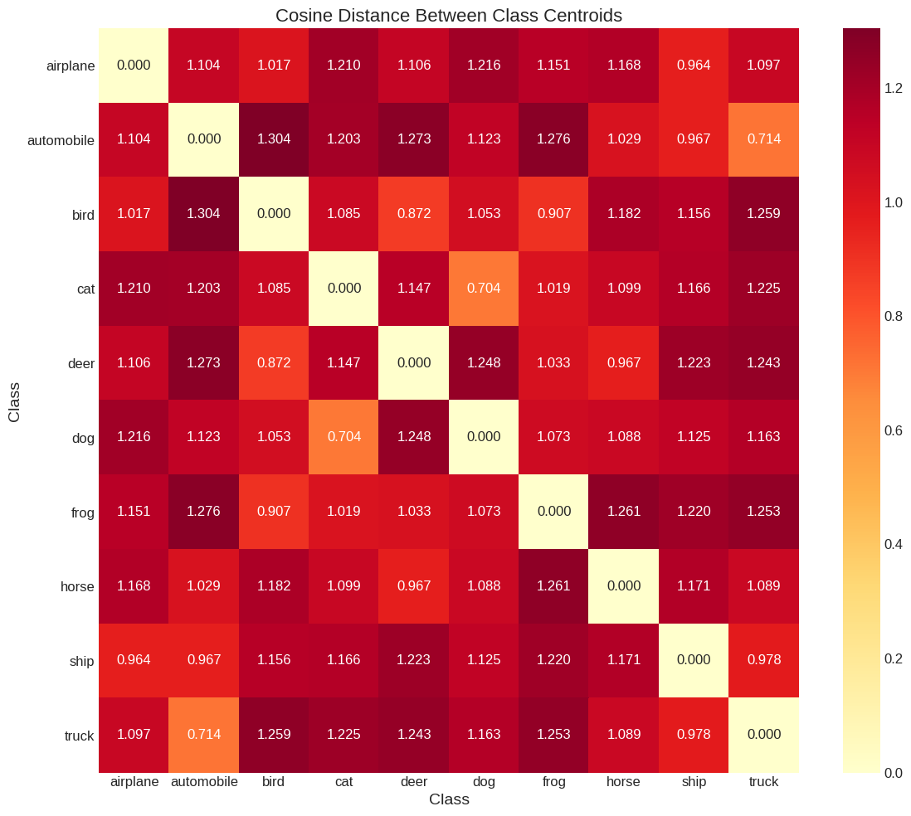
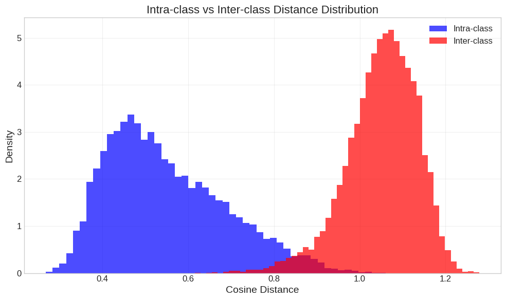
---

## Proposed Hypotheses

The study tests four hypotheses about which feature families distinguish which anomaly types:

### H1: Geometric Features Detect Domain and Magnitude Errors
Geometric features (embedding space structure) separate OOD and Gross errors from the rest, but fail to distinguish Near-Miss from Clean-Hard. The experiments would validate that embedding space captures domain shift and large semantic gaps, but semantic plausibility makes Near-Miss indistinguishable from Clean-Hard in geometry alone.

### H2: Uncertainty Features Separate Medium-Tier Anomalies

Model confidence and entropy distinguish Random Flip and Gross errors from Clean and Near-Miss, but confuse Near-Miss with Clean-Hard. The experiments would show that uncertainty captures the model's lack of confidence on implausible labels (Random Flip, Gross), but cannot resolve the ambiguity between mislabeled but plausible samples (Near-Miss) and legitimately hard samples (Clean-Hard).

### H3: Training Dynamics Break Near-Miss/Clean-Hard Degeneracy

Temporal learning patterns distinguish Clean-Hard (initially learned, then stable) from Near-Miss (learned then forgotten, or never stably learned). The experiments would analyze loss and confidence trajectories during training to show that Clean-Hard samples are consistently learned and retained, while Near-Miss samples exhibit unstable learning patterns (initial memorization followed by rejection, or oscillating correctness). This would confirm that training dynamics provide a unique signal for mislabeling that geometry and uncertainty cannot resolve.


### H4: Dedicated Signals for Corrupted and Ambiguous

Image quality metrics separate Corrupted; human confidence separates Ambiguous. The experiments would validate that pixel-level features (blur, contrast) effectively identify Corrupted samples regardless of label correctness, while human annotation metadata (confidence scores, disagreement rates) uniquely identify Ambiguous samples that are inherently uncertain even to humans.

---

## Feature Extraction

**Clean ViT**: Trained only on clean CIFAR samples. Provides reference geometry in a "ground truth" embedding space
**Noisy ViT**: Trained on all 8 anomaly types. Provides uncertainty estimates shaped by label noise exposure


## Features

### Geometric Features (Clean ViT) - 5 features

#### 1. `geo_cos_assigned`
Cosine similarity between sample embedding and assigned class centroid.


- **High values** (>0.8): Sample is semantically coherent with assigned label (likely Clean or Clean-Hard)
- **Medium values** (0.5-0.8): Sample is somewhat related to assigned label (Near-Miss candidate)
- **Low values** (<0.5): Sample is unrelated to assigned label (Gross or OOD)


#### 2. `geo_rank_assigned`
Rank of assigned class among all classes when sorted by centroid similarity (1 = closest, 10 or 100 = furthest).

- **Rank 1**: Assigned label is the most semantically similar class → Clean or Clean-Hard
- **Rank 2-3**: Assigned label is close but not closest → Near-Miss candidate (true class might be rank 1)
- **Rank > 5**: Assigned label is far from semantically reasonable → Gross or Random Flip


#### 3. `geo_mahal_assigned`
Mahalanobis distance to assigned class distribution (accounts for class covariance, not just centroid).

- **Low values**: Sample is typical for assigned class (Clean)
- **Medium values**: Sample is atypical but within class distribution (Clean-Hard)
- **High values**: Sample is outside class distribution (Near-Miss, Gross, OOD)


#### 4. `geo_ratio_assigned_neighbor`
Ratio of similarity to assigned class vs. nearest other class.

- **Ratio > 1**: Assigned class is closer than any other class → Clean
- **Ratio ≈ 1**: Assigned class and nearest neighbor are equally close → Near-Miss (boundary case)
- **Ratio < 1**: Another class is closer than assigned class → Mislabeled


#### 5. `geo_local_density`
Number of samples within radius threshold in embedding space (k-nearest neighbor density).

- **High density**: Sample is in a dense region of embedding space → Typical sample (Clean, Clean-Hard)
- **Low density**: Sample is in a sparse region → Atypical (OOD, outlier within class)

OOD samples from MIT Scenes should have very low density because they're isolated from CIFAR clusters.


---

### Image Quality Features (Pixel-level) - 4 features

Detect visual corruption independent of label correctness. Tests H4.

#### 1. `iq_blur`
Laplacian variance (edge sharpness).

- **High values** (>2000): Sharp image → Clean, Near-Miss, Gross, etc.
- **Low values** (<500): Blurry image → Corrupted (blur corruption applied)

Laplacian variance directly measures high-frequency content. Blurred images lose edge detail.


#### 2. `iq_contrast`
Standard deviation of pixel intensities.

- **High values** (>40): High contrast → Normal image
- **Low values** (<20): Low contrast → Corrupted (contrast reduction applied)

Low-contrast images have pixel values concentrated in a narrow range.


#### 3. `iq_hf_ratio`
Ratio of high-frequency to low-frequency energy in FFT spectrum.

- **High values** (>0.4): Rich high-frequency content → Sharp, detailed image
- **Low values** (<0.2): Suppressed high-frequencies → Blurred or smoothed image


#### 4. `iq_brightness`
Mean pixel intensity.

**Why it matters**:
- **High values** (>150): Bright image → Normal
- **Low values** (<80): Dark image → Corrupted (brightness reduction applied)

---

### Uncertainty Features (Noisy ViT) - 6 features

**Purpose**: Capture model confidence and prediction stability. Tests H2.

#### 1. `unc_confidence`
Maximum softmax probability (model's certainty in its prediction).

- **High values** (>0.9): Model is confident → Clean, Clean-Hard
- **Medium values** (0.5-0.9): Model is uncertain → Near-Miss, Ambiguous
- **Low values** (<0.5): Model is very uncertain → Random Flip, Gross

Models trained on noisy data learn to be less confident on mislabeled samples (though this can also occur for legitimately hard samples).


#### 2. `unc_entropy`
Shannon entropy of prediction distribution (spread of probability mass).

- **Low values** (0-0.2): Peaked distribution (confident prediction) → Clean
- **High values** (>1.0): Flat distribution (uniform uncertainty) → Random Flip, very hard samples

Entropy measures how "spread out" the probability distribution is. Random Flip samples should have near-uniform distributions.

#### 3. `unc_margin`
Difference between top-1 and top-2 predicted class probabilities.

- **High margin** (>0.7): Clear winner (confident) → Clean
- **Low margin** (<0.3): Top-2 classes have similar probabilities → Near-Miss, Ambiguous

Near-Miss samples often have the true class as the second-highest prediction, resulting in low margin.


#### 4. `unc_model_disagree`
Binary indicator if Clean ViT and Noisy ViT predictions differ.

- **Disagree (1)**: Clean model (trained on clean data) predicts differently than Noisy model → Sample is likely noisy
- **Agree (0)**: Both models agree → Sample is likely clean

Clean ViT hasn't seen label noise, so it predicts based on true semantic structure. Noisy ViT has adapted to noise. Disagreement suggests the sample is in a noisy region.


#### 5. `unc_kl_divergence`
KL divergence from Clean ViT distribution to Noisy ViT distribution.

- **Low KL** (<0.2): Similar distributions → Models agree on semantics → Clean or Clean-Hard
- **High KL** (>1.0): Divergent distributions → Models disagree → Noisy sample

Continuous version of `unc_model_disagree`. Captures degree of disagreement, not just binary mismatch.


#### 6. `unc_topk_entropy`
Entropy computed over only top-k classes (k=3).

 Regular entropy can be high simply because there are many classes. Top-k entropy focuses on whether the model is uncertain among the most likely classes specifically. Near-Miss samples should have high top-k entropy because the true class and assigned class are both in top-k.

---

### Training Dynamics Features (Noisy ViT) - 4 features

Capture temporal learning patterns during training. Tests H3.

Clean-Hard samples are learned early and retained (stable). Near-Miss samples are either learned then forgotten (memorization followed by rejection), or never stably learned (oscillating correctness).

#### 1. `dyn_forgetting_events`
Number of times a sample transitions from correct → incorrect prediction during training.

- **Zero forgetting**: Sample is either always correct (Clean) or always wrong (very hard/mislabeled)
- **High forgetting** (≥2): Sample is learned then forgotten repeatedly → Mislabeled

Models initially memorize all samples (including mislabeled ones), but as training progresses, they "forget" samples that don't fit the learned patterns. Near-Miss samples are semantically plausible enough to be memorized, but eventually rejected as inconsistent.


#### 2. `dyn_late_loss`
Cross-entropy loss at final epoch (or mean over last 10 epochs).

- **Low late loss** (<0.5): Model has learned this sample → Clean, Clean-Hard
- **High late loss** (>2.0): Model never learned this sample → Mislabeled or extremely hard

Samples with high late loss are those the model "gave up on" after many epochs. These are strong candidates for mislabeling.


#### 3. `dyn_learning_improvement`
Reduction in loss from early epochs to late epochs.

- **Positive improvement**: Sample was learned → Clean, Clean-Hard
- **Zero/negative improvement**: No learning progress → Mislabeled

Near-Miss samples may show initial improvement (memorization) followed by increase (forgetting), resulting in low net improvement.

#### 4. `dyn_cartography_confidence`
Mean model confidence across all training epochs (from Dataset Cartography paper).

- **High mean confidence** (>0.8): "Easy to learn" samples → Clean
- **Medium mean confidence** (0.5-0.8): "Ambiguous" samples → Near-Miss, Ambiguous
- **Low mean confidence** (<0.5): "Hard to learn" samples → Random Flip, Gross

Complements `unc_confidence` by averaging over training history rather than using final-epoch value.

---

### Label Agreement Features (Metadata) - 2 features

 Leverage external signals orthogonal to model behavior.

#### 1. `label_human_confidence`
Agreement rate among human annotators from CIFAR-N.

- **High confidence** (>0.8): Humans agree → Clear label → Clean
- **Medium confidence** (0.5-0.8): Some disagreement → Ambiguous
- **Low confidence** (<0.5): High disagreement → Ambiguous or very difficult

Only available for samples in CIFAR-N. Tests H4 directly.

#### 2. `label_conf_gap`
Difference between model confidence on synthetic label vs. original CIFAR label.

- **Positive gap**: Model prefers synthetic label → Clean or Near-Miss (if synthetic is correct)
- **Negative gap**: Model prefers original CIFAR label → Gross or Random Flip (synthetic is implausible)

This feature is the single strongest discriminator in practice because it directly compares model preference for the assigned label vs. the ground truth.


---
# Hypothesis Testing and Results
**Evaluation Setup**: All classifiers tested using 5-fold stratified cross-validation with standardized preprocessing and fixed random seed (42).

**Metrics**: Per-class F1-score , macro F1, confusion matrix , feature importance 

Classifiers:  Random Forest, XGBoost, Logistic Regression, SVM, KNN. 
## Hypothesis-by-hypothesis interpretation
### H1: Geometric Features Detect Domain-Level and Magnitude Errors

The original expectation was that geometry features would work well for OOD and gross errors, but would struggle on near-miss and clean-hard samples. The binary results partly supported this pattern only in a weak sense.
| H1 task | Expected | Best model | Best macro F1 | Observation |
|---|---|---|---:|---|
| OOD vs Clean | High  | Decision Tree  | 0.5165  | Weak |
| Gross vs Clean | Moderate to high  | Decision Tree  | 0.5193  | Weak |
| Near-Miss vs Clean | Low  | Decision Tree  | 0.5214  | Weak |
| Clean-Hard vs Clean | Low  | Decision Tree  | 0.5265  | Weak |


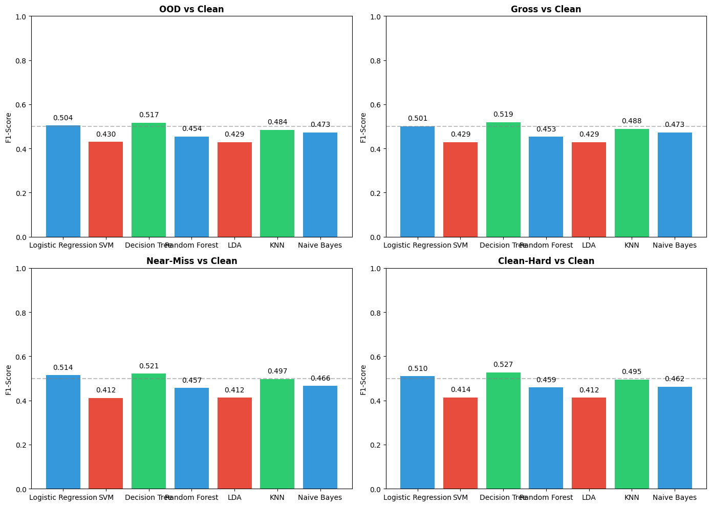
In simple terms, geometry did not clearly solve any of these tasks. Even the best scores are still barely above 0.5, so geometry features were not strongly separating one anomaly type from another. Both OOD and gross errors look identical in embedding space: they have low similarity to the assigned class. The model cannot tell the difference between domain shift and label errors based on geometry alone.

### H2: Uncertainty Features Separate Medium-Tier Anomalies from Clean/Hard

The uncertainty hypothesis expected better performance on medium-difficulty anomalies such as gross and random-flip, but confusion between near-miss and clean-hard. The results mostly match that story, although the absolute performance is still modest

**Results**:
| H2 task | Best model | Best macro F1 | Observation |
|---|---|---:|---|
| Gross vs Clean  | Logistic Regression  | 0.4939  | Weak |
| Random-Flip vs Clean  | KNN  | 0.4831  | Weak |
| Near-Miss vs Clean-Hard  | KNN  | 0.5018  | Weak |


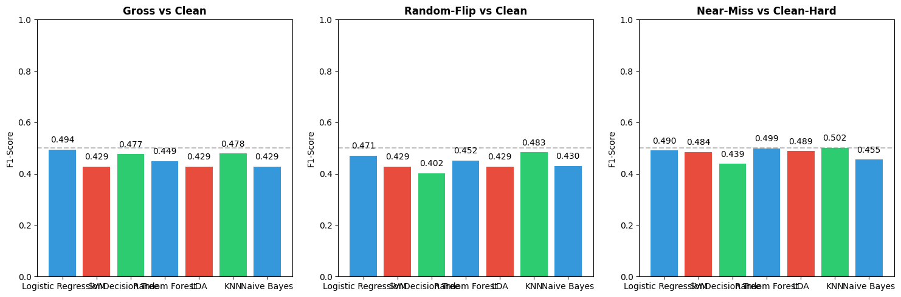
The results suggest that uncertainty features capture some signal for clearly problematic labels, yet they still cannot cleanly separate the hardest confusing pair.The Noisy ViT model learned to be less confident on some mislabeled samples, especially those that are semantically implausible. However, the model also became overconfident on near-miss samples (semantically plausible but wrong), which limits performance on harder cases.
**Feature Importance**:
```
Top uncertainty features:
  unc_kl_divergence:    5.3% importance
  unc_topk_entropy:     5.1%
  unc_entropy:          4.7%
  unc_margin:           4.6%
  unc_confidence:       4.4%
```


---

### H3: Training Dynamics Break Near-Miss/Clean-Hard Degeneracy

The training dynamics hypothesis expected dynamics to break the tie between near-miss and clean-hard by using learning behavior over time. In practice, this did not happen convincingly

**Results**:

| H3 task | Expected | Best model | Best macro F1 | Observation |
|---|---|---|---:|---|
| Near-Miss vs Clean-Hard | High, better than H2  | KNN  | 0.5088  | Weak |

**Feature Importance**:
```
dyn_forgetting_events:       0.000% 
dyn_late_loss:               2.5%
dyn_learning_improvement:    0.000%
dyn_cartography_confidence:  1.3%
```
While H3 is slightly higher than the best H2 score numerically, the gain is tiny and does not support the original claim that dynamics would clearly break the degeneracy between near-miss and clean-hard.
The Noisy ViT model was trained for only **9 epochs** with early stopping (stopped at epoch 2). This is likely too short for the dynamics features to capture meaningful patterns.  With only 9 epochs, samples didn't have time to transition from correct to incorrect predictions, so `dyn_forgetting_events` is zero for all samples. Features like `dyn_learning_improvement` show no variation across samples, making them useless for classification.


### H4: Specialized Features for Corrupted and Ambiguous

The specialized-signal hypothesis had two parts: image-quality features should detect corrupted samples, and label-agreement features should detect ambiguous samples. These two parts had very different outcomes.
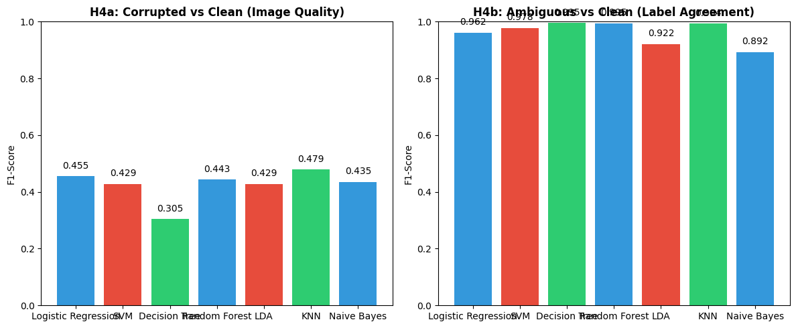

| H4 task | Expected | Best model | Best macro F1 | Reading |
|---|---|---|---:|---|
| Corrupted vs Clean | High  | KNN  | 0.4794 | Failed |
| Ambiguous vs Clean | High  | Decision Tree  | 0.9950    | success |

- For corrupted detection, the result was poor. Even the best binary model, KNN, reached only 0.4794, and the final multiclass F1 for corrupted was only 0.001.
- For ambiguous detection, the result was the clearest success in the project. The best binary model, Decision Tree, reached 0.9950, and the final multiclass F1 for ambiguous was 0.715 This shows that human disagreement provides a strong and unique signal that the model-based features do not capture well on their own

**Histogram overlap analysis** between Clean and Corrupted samples for the four image quality features revealed near-complete distribution overlap :

| Feature | Clean μ±σ | Corrupted μ±σ | Overlap % |
|---------|-----------|---------------|-----------|
| iq_blur | 2377±1519 | 2342±1491 | **90.1%** |
| iq_contrast | 49.9±15.6 | 49.2±15.5 | **89.8%** |
| iq_hf_ratio | 0.47±0.11 | 0.47±0.11 | **90.1%** | 
| iq_brightness | 123.6±34.3 | 123.2±34.8 | **89.3%** | 

The applied corruptions (σ=25 for blur, 0.3× contrast/brightness) were too mild to create a distinguishable signal at 32×32 resolution. The distributions of image quality features for Corrupted samples are almost identical to Clean samples, leading to near-zero F1.
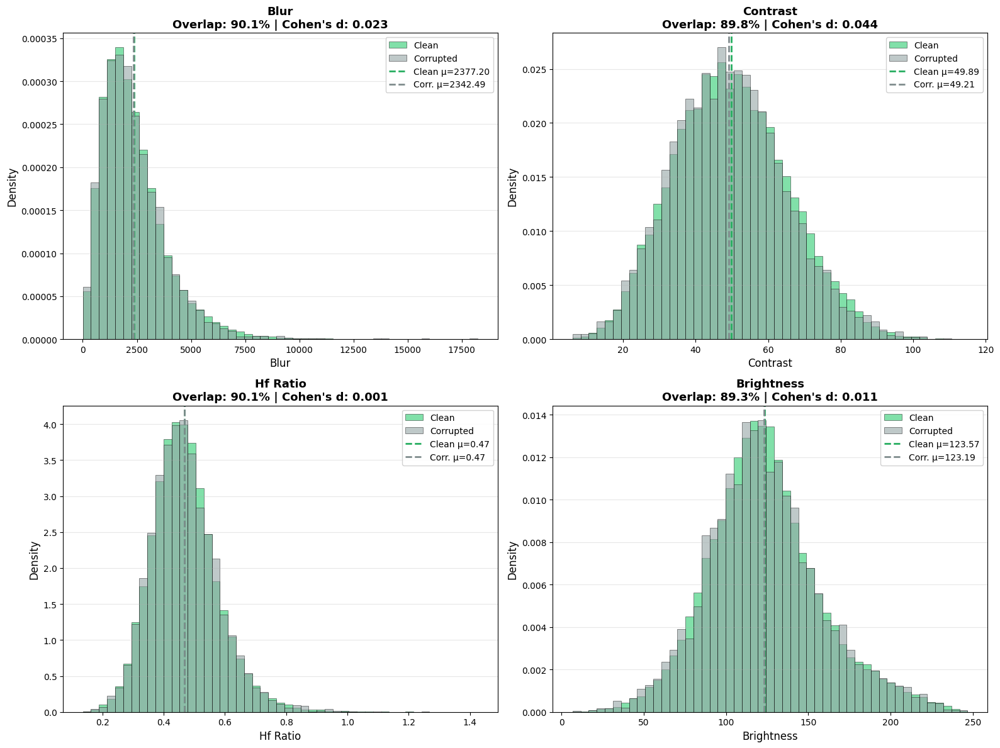


### Overall Results

The full 8-class classification task reached a macro F1-score of 0.3518, which means overall performance is still limited when the model must separate all anomaly types at once.


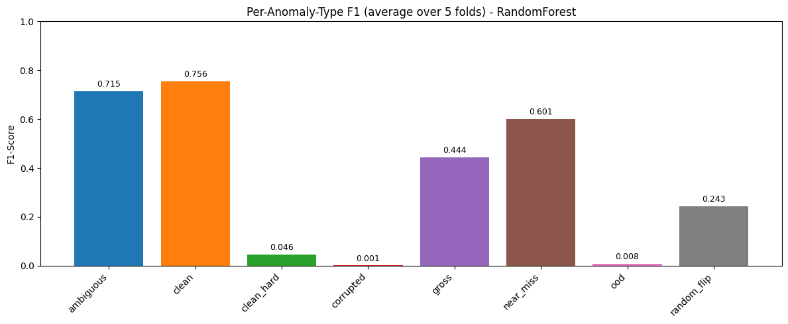

## Conclusion
```markdown
================================================================================
COMPLETE HYPOTHESIS TESTING SUMMARY
================================================================================
Hypothesis                    Task    Feature Type              Expected  F1-Score (LR) Status
        H1            OOD vs Clean        Geometry                  HIGH       0.503737      ✗
        H1          Gross vs Clean        Geometry         MODERATE-HIGH       0.501086      ✗
        H1      Near-Miss vs Clean        Geometry                   LOW       0.514489      ✓
        H1     Clean-Hard vs Clean        Geometry                   LOW       0.509917      ✓
        H2          Gross vs Clean     Uncertainty              MODERATE       0.493896      ✓
        H2    Random-Flip vs Clean     Uncertainty              MODERATE       0.471137      ✓
        H2 Near-Miss vs Clean-Hard     Uncertainty                   LOW       0.490218      ✓
        H3 Near-Miss vs Clean-Hard        Dynamics                  HIGH       0.482582      ✗
        H4      Corrupted vs Clean   Image Quality                  HIGH       0.454901      ✗
        H4      Ambiguous vs Clean Label Agreement                  HIGH       0.961574      ✓

```
We tested a 4-hypothesis framework for detecting 8 anomaly types in noisy image classification datasets. Of the 4 hypotheses, **only 1 fully succeeded** . So, the current pipeline is not broadly reliable across all anomaly types. It is strongest when it has access to an external signal that directly reflects ambiguity, somewhat useful for some label-noise cases, and still weak at separating subtle visual corruption, true domain shift, and very hard clean examples.

## Author 
```
Nazia Tasnim
BUID: U79654469
```